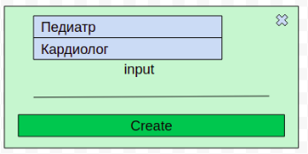

## Завдання

Вам потрібно створити сторінку, де Секретарка зможе створювати картки, що описують заплановані візити до лікарів.

На сторінці повинні бути:

1. Header (шапка) сторінки:
   - у лівому верхньому кутку – логотип. Можна взяти будь-який
   - у правому кутку – Кнопка "Вхід". Після успішної авторизації вона має змінюватися на Кнопку "Створити візит".
2. Під Header – форма для фільтрації візитів. У цій формі має бути 3 поля:
   - пошук за заголовком/вмістом візиту
   - пошук за статусом (Open/Done) (візит пройшов чи ще ні)
   - терміновість візиту (High, Normal, Low)
3. Під формою фільтрів – список створених візитів.

#### Командна робота

На цьому проекті всі студенти поділені на групи по три особи. Студенти можуть розподіляти між собою завдання самостійно. При здачі проекту необхідно у файлі `Readme.md` вказати, хто виконував якусь частину завдання.

#### Технічні вимоги 

 - При першому відвідуванні користувачем сторінки, на дошці має бути напис `No items have been added`. Цей же напис має бути, якщо у користувача немає жодної доданої картки (наприклад, він їх все видалив).
 - На кліку на кнопку **Вхід** з'являється модальне вікно, в якому користувач вводить свій email та пароль. Якщо він вірний – користувачеві на сторінці виводиться список раніше створених візитів.
 - По кліку на кнопку **Створити візит** з'являється модальне вікно, в якому можна створити нову картку.
 - Для створення класів потрібно використовувати синтаксис `class` із ES6.
 - Для AJAX запитів можна використовувати `fetch` або `axios`.
 - Після виконання будь-яких запитів AJAX, сторінка не повинна перезавантажуватися. При додаванні/видаленні картки та інших подібних операціях із сервера **не повинен** заново завантажуватися весь список карток. Необхідно використовувати дані з відповіді сервера та Javascript для оновлення інформації на сторінці.
 - При оновленні сторінки або її закритті раніше додані нотатки не повинні пропадати.
 - Бажано поділити проект на модулі за допомогою ES6 modules.

##### Модальне вікно "Створити візит"
   
У модальному вікні повинні бути:

- Випадаючий список (select) з вибором лікаря. Залежно від обраного лікаря, під цим списком будуть з'являтися поля, які потрібно дозаповнити для візиту до цього лікаря.
- У списку має бути три опції - **Кардіолог**, **Стоматолог**, **Терапевт**.
- Після вибору лікаря зі списку, під ним повинні з'явитися поля для запису до цього лікаря. Декілька полів є однаковими для всіх трьох докторів:
  - мета візиту
  - короткий опис візиту
  - дропдаун - терміновість (звичайна, пріоритетна, невідкладна)
  - ПІБ
- Також кожен з лікарів має свої унікальні поля для заповнення. Якщо вибрано опцію **Кардіолог**, додатково з'являються такі поля для введення інформації:
  - звичайний тиск
  - Індекс маси тіла
  - перенесені захворювання серцево-судинної системи
  - вік
- Якщо вибрано опцію **Стоматолог**, додатково необхідно заповнити:
  - дата останнього відвідування
- Якщо вибрано опцію Терапевт, додатково необхідно заповнити:
  - вік
- Кнопка `Створити`. При натисканні на кнопку надсилається AJAX запит на відповідну адресу, і якщо у відповіді надійшла інформація про новостворену картку - створюється картка у Дошці візитів на сторінці, модальне вікно закривається.
- Кнопка `Закрити` - закриває модальне вікно без збереження інформації та створення картки. По кліку на область поза модальним вікном - модальне вікно також закривається.
- Усі поля вводу, незалежно від вибраної опції, крім поля для додаткових коментарів, є обов'язковими для введення даних. Валідацію на коректність даних робити необов'язково.

##### Картка, що описує візит

Картка, яка створюється по кліку, з'являється на дошці завдань. Це має виглядати приблизно так:

   
У ній мають бути:
 - ПІБ, які були введені під час створення картки
 - Лікар, до якого людина записана на прийом
 - Кнопка `Показати більше`. На кліку на неї картка розширюється, і з'являється решта інформації, яка була введена під час створення візиту
 - Кнопка `Редагувати`. При натисканні на неї замість текстового вмісту картки з'являється форма, де можна відредагувати введені поля. Така ж, як у модальному вікні під час створення картки
 - Іконка з хрестиком у верхньому правому кутку, при натисканні на яку картку буде видалено

##### Фільтри візитів

Фільтр карток (поле input для введення тексту пошуку за заголовком або описом візиту, фільтр по статусу,  по пріоритету) вам потрібно робити на фронт-енді - тобто при зміні `value` будь-якого елемента форми (вибраний пункт у списку, що було введено щось в `input`) ви фільтруєте список раніше отриманих з сервера карток, і відображаєте на екрані нову інформацію.

За принципом роботи система має бути схожою на фільтри в інтернет-магазинах (наприклад, зліва [тут](https://rozetka.com.ua/notebooks/c80004/)).

##### Класи

У JavaScript коді обов'язково мають бути такі класи:
 - клас Modal (модальне вікно);
 - клас Visit (що описує загальні для всіх візитів до будь-якого лікаря поля та методи);
 - дочірні класи VisitDentist, VisitCardiologist, VisitTherapist;

Методи та властивості кожного класу вам потрібно продумати самостійно. При необхідності ви можете додавати також інші класи.

#### Вимоги до реалізації

Дизайн може бути будь-який, але він має бути.

#### AJAX частина

Вся необхідна документація по взаємодії з сервером AJAX знаходиться [тут](https://ajax.test-danit.com/api-pages/cards.html).

#### Необов'язкове завдання підвищеної складності

 - При створенні картки візиту виконувати валідацію коректності введених даних. Правила для валідації можна придумати самостійно (наприклад, звичайний тиск повинен бути числом і перебувати в діапазоні від 50 до 160)
 - Додати можливість користувачеві переміщувати картки на дошці методом Drag&Drop. Такі маніпуляції з карткою не впливають на місце розташування інших карток. Після перетягування картки не потрібно "запам'ятовувати" її нове місце розташування. При перезавантаженні сторінки вона може повернутися на початкове місце.
